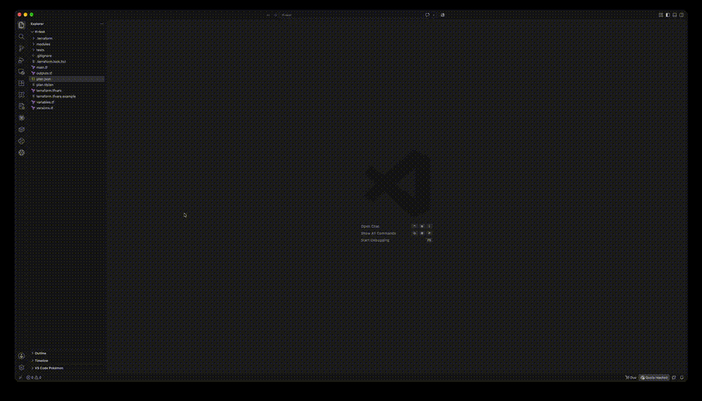

# Preflight — Terraform Plan Viewer for AWS

[](https://github.com/theosylvestre/preflight/actions/workflows/ci.yml)
[](LICENSE)

Review Terraform plans and states of AWS infrastructure without scrolling through `terraform plan`
output: the JSON output of `terraform show -json` (or a `terraform.tfstate`) opened as a plan summary
with filters by action, an attribute-by-attribute diff for each resource, and a graph of who can access
what through IAM.



| IDE | Folder | Documentation |
|---|---|---|
| VS Code | [`vsc/`](vsc/) | [vsc/README.md](vsc/README.md) (Marketplace page: usage, supported features, graph) |
| IntelliJ IDEA, PyCharm and the other JetBrains IDEs (2025.1+) | [`jetbrains/`](jetbrains/) | [jetbrains/README.md](jetbrains/README.md) (usage, architecture, test environment) |

Both show the same page (`core/media`) built from the same parsers (`core/src`): only the thin
host layer differs — the VS Code webview API on one side, JCEF and a small bridge on the other.

## Repository layout

- [`core/`](core/): everything that does not depend on an IDE.
  - [`scripts/build.mjs`](core/scripts/build.mjs): bundle for hosts without Node runtime
    (`dist/preflight-core.js`, with the AWS icon index embedded).
  - [`src/planParser.js`](core/src/planParser.js): turns the JSON plan into diff lines.
  - [`src/planGraph.js`](core/src/planGraph.js): builds the IAM graph (roles, policies, permissions).
  - [`src/stateParser.js`](core/src/stateParser.js): turns a state into a plan-shaped document (inferred references).
  - [`src/viewModel.js`](core/src/viewModel.js): the model the viewer displays (icons, graph groups, module sources).
  - [`src/awsServices.js`](core/src/awsServices.js) + [`media/aws-icons/`](core/media/aws-icons/): AWS service
    icon per resource (official AWS Architecture Icons pack; `make clean-icons` keeps only the 64 px `.svg` files).
  - [`media/`](core/media/): the viewer page (`viewer.html`, `viewer.js` for the plan, `graph.js` for the graph, CSS).
  - [`test/`](core/test/): parser, graph, state and view model unit tests (mocha, no IDE needed).
- [`vsc/`](vsc/): the VS Code extension.
  - [`extension.js`](vsc/extension.js): activation, commands.
  - [`src/planEditor.js`](vsc/src/planEditor.js): read-only custom editor (webview).
  - [`scripts/build.mjs`](vsc/scripts/build.mjs): bundles `core` into `vsc/dist/` and copies `core/media`
    into `vsc/media/` (vsce only packages the extension folder).
  - [`test/`](vsc/test/): VS Code integration tests.
- [`jetbrains/`](jetbrains/): the IntelliJ Platform plugin (Kotlin, Gradle); its build takes the page and
  the core bundle from `core/`.
- [`tf-test/`](tf-test/): sample Terraform project with a generated `plan.json`, for trying the extensions.

## Development

Requirements: Node.js 22+ and pnpm (the version is pinned in `package.json`); for the JetBrains plugin,
a JDK 17+ to run Gradle (on macOS, the one bundled with IntelliJ IDEA is used when `JAVA_HOME` is not set).

### VS Code extension

```sh
pnpm install
pnpm test      # lint, core unit tests and VS Code integration tests
make package   # builds preflight-tf-aws-<version>.vsix at the root
make install   # same, then installs it in VS Code
```

- `F5` ("Run Extension" config): builds the extension and starts a VS Code window with it loaded.
- `make run`: same, without debugger, opened on the sample project [`tf-test/`](tf-test/) and its `plan.json`.
- If the debugger fails to connect to the extension host (`ECONNREFUSED ::1`), use the
  "Run Extension (attach 127.0.0.1)" config instead: it runs `make debug` (inspector on
  `127.0.0.1:9229`) and attaches over IPv4.

### JetBrains plugin

```sh
pnpm install          # esbuild, for the core bundle
make jb-test          # unit, platform (headless IDE) and bridge tests
make jb-run           # sandbox IntelliJ IDEA 2025.1 with the plugin, on tf-test/plan.json
make jb-run-pycharm   # same in PyCharm
make jb-build         # jetbrains/build/distributions/preflight-jetbrains-<version>.zip
```

Or open `jetbrains/` in IntelliJ IDEA: run configurations are provided in `jetbrains/.run/`. Details in
[jetbrains/README.md](jetbrains/README.md#development).

Changes to the viewer (`core/media`) or the parsers (`core/src`) apply to both: run `pnpm test` and
`make jb-test`.

## Credits

AWS service icons come from the [AWS Architecture Icons](https://aws.amazon.com/architecture/icons/) pack.
Preflight is an independent project, not affiliated with or endorsed by Amazon Web Services or HashiCorp.

## License

[MIT](LICENSE)
